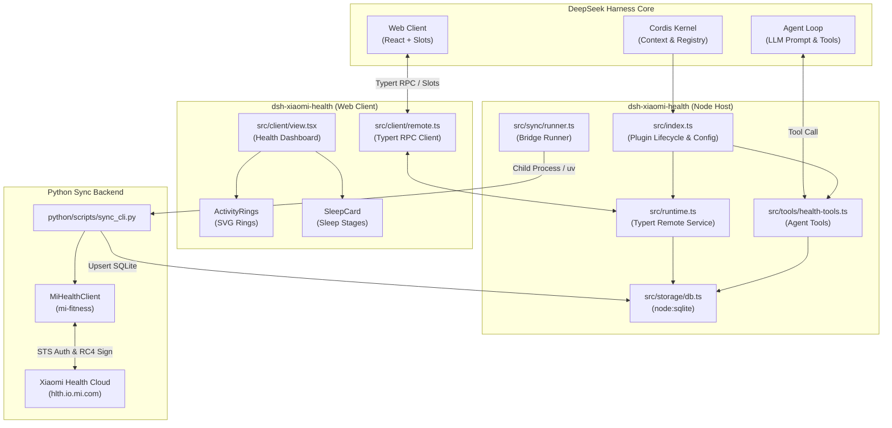

# dsh-xiaomi-health: Xiaomi Health Plugin for DeepSeek Harness

English | [简体中文](README.zh.md)

> **DeepSeek Harness (DSH)** wearable health monitoring and AI analytics plugin. Deeply integrates Xiaomi Health (Mi Fitness / Zepp Life) cloud synchronization, provides a modern glassmorphic dashboard for the DSH Web client, and equips DSH AI agents with a comprehensive suite of health tools.

---

## Python sdk
Read https://github.com/ridd1ot/xiaomi-health-sync


## Table of Contents

- [Key Features](#-key-features)
- [Architecture & Modules](#-architecture--modules)
- [How It Works with DeepSeek Harness](#-how-it-works-with-deepseek-harness)
- [Directory Layout](#-directory-layout)
- [Quick Start & Verification](#-quick-start--verification)
  - [1. Installation & Build](#1-installation--build)
  - [2. Run Automated Tests](#2-run-automated-tests)
  - [3. Mounting in DSH](#3-mounting-in-dsh)
- [Authentication & Syncing](#-authentication--syncing)
- [DSH Agent Tools](#-dsh-agent-tools)
- [Configuration Reference](#-configuration-reference)
- [Technical Highlights](#-technical-highlights)

---

## 🌟 Key Features

1. **Dual-Side Architecture (Host + Client)**:
   - **Host Half**: Runs on the Cordis microkernel, exposing a Typert Remote Service, local zero-native-dependency SQLite persistence via `node:sqlite`, background auto-sync scheduling, and model-facing tools.
   - **Client Half**: Mounts seamlessly into DSH Web Client's `conversation.view` slot with vibrant Activity Rings, multi-stage sleep architecture breakdowns, heart rate zones, and quick action buttons.
2. **Instant Offline Mock Mode**:
   - Enabled by default (`mockMode: true`). Instantly generates 14 days of realistic multi-stage health metrics (deep/light/REM sleep, diurnal heart rate, calories, steps, and standing goals) for out-of-the-box UI and AI evaluation without requiring a physical device.
3. **Resilient Python Sync Engine**:
   - Built on `ridd1ot/xiaomi-health-sync` principles, incorporating endpoint routing fixes for China region accounts (`hlth.io.mi.com`), family accounts, and STS token auto-renewal.
4. **DSH Agent Toolchain**:
   - Exports 5 tools (`health_get_summary`, `health_query_metrics`, `health_query_sleep`, `health_sync_now`, `health_get_insights`) allowing LLMs to ground health evaluations in verifiable local records.

---

## 📐 Architecture & Modules



---

## 🤝 How It Works with DeepSeek Harness

1. **Declarative Composition (`cordis.patch.yml`)**:
   - DSH profile compositions discover and mount the plugin layer. Whether launched as `dsh web` or `dsh headless`, the harness loads `dsh-xiaomi-health` during bootstrap.
2. **Typert Remote RPC Gateway**:
   - `HealthRuntime` extends `TypertRemoteService` on the host side, exposing methods decorated with `@Remote`.
   - The browser mounts `DSH_HEALTH_REMOTE` and calls typed methods validated against identical `Zod` wire schemas defined in `src/contract.ts`.
3. **Slot-Based Client Rendering (`sidebar.panellist` & `main`)**:
   - **Primary Entrance (Global Sidebar Panel)**: The client registers into `sidebar.panellist` and `main` with a dedicated ❤️ Health icon on the left navigation rail. Clicking it opens a dedicated full-screen Apple Health style dashboard in the main view area without needing any conversation.
   - **Secondary Entrance (`conversation.view`)**: The browser entry also registers into `conversation.view` at priority `25`, allowing quick access directly within an active conversation tab.
4. **Apple Health Design System**:
   - Built on pure black OLED background (`#000000`) and Apple secondary grouped cards (`#1C1C1E`);
   - Authentic Apple Watch activity rings: Move (`#FA114F`), Exercise (`#A1FF00`), and Stand (`#00F0FF`);
   - Apple Heart Rate (`#FF2D55`) with 5 zones; Apple Sleep teal/indigo (`#63E6E2` / `#5E5CE6`) architecture; San Francisco typography with tabular numerals.
5. **Model Function Calling (`ctx.tools`)**:
   - The plugin registers 5 tools onto `ctx.tools`. When the user asks health-related questions in natural language, the agent loop calls these tools to inspect the SQLite database and construct grounded answers.

---

## 📂 Directory Layout

```text
dsh-xiaomi-health/
├── package.json              # Exports declaration (. and ./client)
├── dsh.plugin.json           # DSH plugin manifest
├── cordis.patch.yml          # Cordis profile patch overlay
├── build.mjs                 # Dual-side esbuild bundler
├── tsconfig.json             # Root TypeScript configuration
├── tsconfig.build.json       # Type declaration generator (lib/types)
├── vitest.config.ts          # Test runner configuration
├── src/
│   ├── index.ts              # Host entry: config schema, lifecycle, effect registration
│   ├── contract.ts           # Strict Typert RPC wire contract and Zod schemas
│   ├── types.ts              # Shared domain models (DailyMetrics, SleepSegment, etc.)
│   ├── typert.ts             # Host Typert manifest declaration
│   ├── runtime.ts            # Host TypertRemoteService implementation
│   ├── storage/
│   │   ├── schema.ts         # SQLite schema DDL
│   │   ├── db.ts             # Type-safe SQLite access using node:sqlite
│   │   └── mock-data.ts      # Multi-day realistic mock data generator
│   ├── sync/
│   │   ├── runner.ts         # Bridge to Python sync process
│   │   └── scheduler.ts      # Background auto-sync scheduler
│   ├── tools/
│   │   └── health-tools.ts   # 5 DSH Agent tools
│   └── client/
│       ├── index.tsx         # Client entry: i18n, styles, conversation.view injection
│       ├── view.tsx          # Modern glassmorphic health dashboard
│       ├── remote.ts         # Client Typert remote namespace augmentation
│       ├── locales.ts        # Bilingual dictionaries (zh / en)
│       ├── styles.ts         # Glassmorphism CSS styles
│       └── components/       # UI subcomponents
│           ├── ActivityRings.tsx   # Concentric SVG activity rings
│           ├── SleepCard.tsx       # Sleep score & proportional stage bar
│           ├── HeartRateCard.tsx   # BPM monitor and 5-tier heart rate zones
│           ├── MetricGrid.tsx      # SpO2, stand hours, weight & distance
│           ├── SyncStatusBar.tsx   # Sync status, badge, and control buttons
│           └── LoginModal.tsx      # QR code login dialog
├── python/                   # Python synchronization backend
│   ├── pyproject.toml
│   ├── requirements.txt      # mi-fitness>=0.2.0, httpx
│   ├── dsh_health/
│   │   ├── __init__.py
│   │   ├── storage.py        # Python SQLite schema & queries
│   │   ├── sync.py           # Endpoint patching, STS exchange & sync
│   │   └── auth_helper.py    # Xiaomi QR login long-poll handler
│   └── scripts/
│       ├── login.py          # Interactive QR login CLI
│       └── sync_cli.py       # Standalone sync runner CLI
└── tests/                    # Full automated test suite
    ├── contract.spec.ts      # Wire contract and schema tests
    ├── storage.spec.ts       # Database CRUD tests
    ├── mock-data.spec.ts     # Mock data generator tests
    ├── runtime.spec.ts       # Host Remote logic tests
    └── tools.spec.ts         # DSH agent tools execution tests
```

---

## 🚀 Quick Start & Verification

### 1. Installation & Build

```bash
cd /home/asdf/dev/dsh-xiaomi-health

# Install dependencies
pnpm install

# Build bundles (lib/index.js & lib/client.js)
pnpm run build
```

### 2. Run Automated Tests

Run the complete test suite:

```bash
pnpm run test
```

All tests run against an in-memory SQLite instance and verify contract integrity, storage operations, and model tool calls.

### 3. Mounting in DSH

From your `deepseek-harness` workspace:

#### Option A: Launch with Web Client UI (Recommended)

```bash
cd /home/asdf/dev/deepseek-harness
pnpm dsh web --patch /home/asdf/dev/dsh-xiaomi-health/cordis.patch.yml
```

Switch to the **Xiaomi Health** tab in the session conversation ring to interact with the dashboard.

#### Option B: Query with Headless Agent

```bash
cd /home/asdf/dev/deepseek-harness
pnpm dsh headless --patch /home/asdf/dev/dsh-xiaomi-health/cordis.patch.yml "Analyze my sleep quality and activity goals over the past week"
```

The agent will invoke `health_get_summary` and `health_query_sleep` to produce an analysis.

---

## 🔑 Authentication & Syncing

### QR Code Login
- **Web UI**: Click "Connect Xiaomi Account" in the dashboard header.
- **Terminal CLI**:
  ```bash
  cd /home/asdf/dev/dsh-xiaomi-health
  pnpm run login
  ```
  Scan the presented QR code with the **Mi Fitness** or **Xiaomi Account** mobile app. Authentication tokens will be stored securely at `data/token.json`.

### Manual & Automatic Sync
- Run manual sync:
  ```bash
  pnpm run sync
  ```
- Configure automatic background sync in `cordis.patch.yml`:
  ```yaml
  - insert:
      - id: dsh-xiaomi-health
        name: dsh-xiaomi-health
        config:
          enableAutoSync: true
          syncIntervalMinutes: 30
          mockMode: false
  ```

---

## 🤖 DSH Agent Tools

| Tool Name | Parameters | Description |
|---|---|---|
| `health_get_summary` | `date?: string` | Fetches daily step progress, active calories, sleep duration & score, resting HR, and SpO2. |
| `health_query_metrics` | `days?: number` (default 7) | Queries time-series daily metrics (steps, heart rate, sleep, calories) across recent days. |
| `health_query_sleep` | `date?: string` | Detailed sleep architecture breakdown (deep, light, REM, awake, and naps). |
| `health_sync_now` | `days?: number` (default 7) | Triggers on-demand synchronization with Xiaomi Cloud. |
| `health_get_insights` | `days?: number` (default 7) | Evaluates multi-day wellness patterns and computes a holistic health score. |

---

## ⚙️ Configuration Reference

Supported `cordis.patch.yml` fields:

```yaml
- insert:
    - id: dsh-xiaomi-health
      name: dsh-xiaomi-health
      config:
        dbPath: data/health.sqlite
        tokenPath: data/token.json
        enableAutoSync: false
        syncIntervalMinutes: 30
        mockMode: true
        familyMode: false
        targetUid: "12345678"
```

---

## 💡 Technical Highlights

1. **Zero Native Addon Compilation for SQLite**:
   - Uses Node.js 22 built-in `node:sqlite` (`DatabaseSync`), bypassing `node-gyp` compilation issues.
2. **Family Account Endpoint Support (`familyMode`)**:
   - Allows sharing data safely via Xiaomi's family relatives sharing link (`/app/v1/relatives/*`), keeping master tokens off secondary servers.
3. **Data Privacy**:
   - SQLite files and tokens stay local in `data/`. No intermediary servers or third-party tracking.


