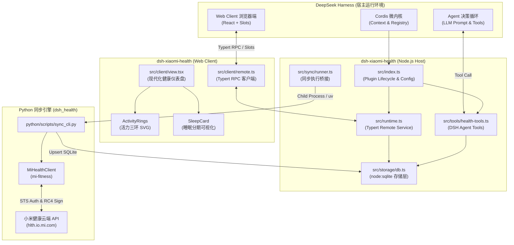

# dsh-xiaomi-health: 小米运动健康 DSH 监控与分析插件

[English](README.md) | 简体中文

> **DeepSeek Harness (DSH)** 穿戴设备健康监控与智能分析插件。深度集成小米运动健康（Mi Fitness / Zepp Life）云端同步能力，配备现代化玻璃拟态（Glassmorphism）交互仪表盘，并为 DSH 智能体提供全套健康查询与分析工具。

---

## 目录

- [核心特性](#-核心特性)
- [系统架构与模块划分](#-系统架构与模块划分)
- [如何与 DeepSeek Harness 协同工作](#-如何与-deepseek-harness-协同工作)
- [目录结构说明](#-目录结构说明)
- [快速上手与测试](#-快速上手与测试)
  - [1. 安装依赖与构建](#1-安装依赖与构建)
  - [2. 运行自动化测试](#2-运行自动化测试)
  - [3. 在 DSH 中挂载并测试](#3-在-dsh-中挂载并测试)
- [小米账号登录与同步机制](#-小米账号登录与同步机制)
- [DSH 智能体工具列表 (Agent Tools)](#-dsh-智能体工具列表-agent-tools)
- [插件配置参数说明](#-插件配置参数说明)
- [常见问题与技术细节](#-常见问题与技术细节)

---

## 🌟 核心特性

1. **双端协同架构 (Host + Client)**：
   - **Host 端**：基于 Cordis 微内核生命周期、Typert 强类型 RPC 服务、`node:sqlite` 本地存储引擎、后台自动同步调度器。
   - **Client 端**：专为 DSH Web Client 设计，自动注册进 `conversation.view` 标签页，拥有极具现代感的多彩活力三环、多相睡眠分期图表、心率区间分布条和指标卡片。
2. **开箱即用的离线演示模式 (Mock Mode)**：
   - 无需真实小米手环或登录账号，默认 `mockMode: true`，一键生成连续 14 天真实波动的健康数据（含深睡/浅睡/REM/小睡分期、心率区间、有效站立与步数目标），方便立即评估 UI 与 Agent 对话。
3. **高兼容性 Python 同步后端**：
   - 基于 `ridd1ot/xiaomi-health-sync` 原理，针对中国大陆账号、亲情账户与本人 UID 端点进行了路由修复（解决 `-4002001` 等错误），支持 STS 凭证自动延期刷新。
4. **智能体健康助手工具链**：
   - 提供 `health_get_summary`、`health_query_metrics`、`health_query_sleep`、`health_sync_now`、`health_get_insights` 等标准模型工具，使 DSH 智能体可随时回答如“我本周睡眠怎么样？”、“今天运动达标了吗？”等健康咨询。

---

## 📐 系统架构与模块划分

整个插件分为四大核心层次：



---

## 🤝 如何与 DeepSeek Harness 协同工作

1. **配置组装 (Profile Overlay)**：
   - 通过 `cordis.patch.yml` 将插件插入 DSH 的运行配置树。无论是 Web 模式 (`dsh web`) 还是命令行自动化模式 (`dsh headless`)，DSH 在引导时读取配置，实例化插件并注入生命周期。
2. **RPC 边界 (Typert Remote Gateway)**：
   - Host 侧的 `HealthRuntime` 继承 `TypertRemoteService`，使用 `@Remote` 装饰器导出异步方法。
   - Client 侧挂载 `DSH_HEALTH_REMOTE`，通过底层 WebSocket/HTTP 双向通道安全通信，所有请求参数与返回结果均由严格的 `Zod` 模式强行校验，避免类型飘移。
3. **视图插槽挂载 (UI Slots)**：
   - **主入口（全局左侧导航栏）**：Client 插件通过 `ctx.slots.inject('sidebar.panellist', ...)` 与 `ctx.slots.inject('main', ...)` 注册为左侧全局独立应用面板（带专属 ❤️ 健康图标）。点击即可在主工作区全屏打开独立的 **Apple Health 风格**健康大屏，不依赖任何会话，打开即可随时使用。
   - **辅助入口（会话标签页）**：同时注册 `ctx.slots.inject('conversation.view', ...)` 作为会话顶栏标签页，满足在具体会话内快速查阅健康状态的需求。
4. **视觉风格 (Apple Health Design System)**：
   - 采用纯黑 OLED 画布 (`#000000`) 与 Apple 质感分组卡片 (`#1C1C1E`)；
   - 官方同款三环配色（活动能量 `#FA114F`、锻炼时长 `#A1FF00`、有效站立 `#00F0FF`）；
   - 心率鲜红 (`#FF2D55`) 与五阶段区间、睡眠水绿/靛蓝 (`#63E6E2` / `#5E5CE6`) 分期架构、SF 字体大号清晰排版。
5. **模型工具挂载 (ctx.tools)**：
   - Host 插件在 `ctx.tools` 上注册 5 个标准化模型工具。当用户在自然语言中询问健康相关问题时，模型会自动通过函数调用（Function Calling）唤起插件读取 SQLite 数据库，生成有据可依的健康评估。

---

## 📂 目录结构说明

```text
dsh-xiaomi-health/
├── package.json              # 插件元信息与双端 exports 声明 (. 和 ./client)
├── dsh.plugin.json           # DSH 扩展插件标准清单
├── cordis.patch.yml          # Cordis 配置补丁（挂载层）
├── build.mjs                 # esbuild 双端快速编译脚本
├── tsconfig.json             # TypeScript 根配置
├── tsconfig.build.json       # 类型声明生成配置 (lib/types)
├── vitest.config.ts          # 单元测试配置
├── src/
│   ├── index.ts              # Host 插件入口：配置校验、微内核注册与生命周期管理
│   ├── contract.ts           # Host 与 Client 严格共享的 Typert Wire 契约与 Zod Schema
│   ├── types.ts              # 领域模型定义（DailyMetrics、SleepSegment、Goals 等）
│   ├── typert.ts             # Host Typert 模型清单声明
│   ├── runtime.ts            # Host 端 TypertRemoteService 具体实现类
│   ├── storage/
│   │   ├── schema.ts         # SQLite 数据库 DDL 建表脚本
│   │   ├── db.ts             # 基于 Node 原生 node:sqlite 的类型安全数据库访问层
│   │   └── mock-data.ts      # 真实拟真数据生成器（覆盖 14 天完整指标与分期）
│   ├── sync/
│   │   ├── runner.ts         # 同步任务调度与 Python 子进程管理桥接器
│   │   └── scheduler.ts      # 定时后台同步轮询器
│   ├── tools/
│   │   └── health-tools.ts   # 注册至 ctx.tools 的 5 个 DSH 智能体工具
│   └── client/
│       ├── index.tsx         # Client 插件入口：注册 i18n 字典、CSS 样式与 View 插槽
│       ├── view.tsx          # 现代化主仪表盘组件（深色模式、数据刷新、Tab 切换）
│       ├── remote.ts         # Client 端 Typert 命名空间定义与类型合并
│       ├── locales.ts        # 中英文多语言字典 (zh / en)
│       ├── styles.ts         # 玻璃拟态 CSS 设计规范与动态注入逻辑
│       └── components/       # 仪表盘拆分组件
│           ├── ActivityRings.tsx   # 活力三环 SVG 环形进度条组件
│           ├── SleepCard.tsx       # 睡眠总评与深睡/浅睡/REM 色块条组件
│           ├── HeartRateCard.tsx   # 实时心率与 5 级心率区间分布条
│           ├── MetricGrid.tsx      # 血氧、站立、体重、距离等指标卡片网格
│           ├── SyncStatusBar.tsx   # 同步状态栏、模式角标与操作按钮
│           └── LoginModal.tsx      # 小米二维码扫码登录弹窗
├── python/                   # Python 同步后端工程
│   ├── pyproject.toml        # Python 依赖与包管理配置
│   ├── requirements.txt      # 依赖声明（mi-fitness>=0.2.0, httpx）
│   ├── dsh_health/
│   │   ├── __init__.py
│   │   ├── storage.py        # Python 端 SQLite schema 与 upsert
│   │   ├── sync.py           # 端点补丁、STS 交换与指标全量同步
│   │   └── auth_helper.py    # 小米二维码轮询登录助手
│   └── scripts/
│       ├── login.py          # 命令行交互式扫码登录脚本
│       └── sync_cli.py       # 命令行/子进程调用同步脚本
└── tests/                    # 完整自动化测试套件
    ├── contract.spec.ts      # 契约与 Schema 校验测试
    ├── storage.spec.ts       # SQLite 数据库读写测试
    ├── mock-data.spec.ts     # 拟真数据生成测试
    ├── runtime.spec.ts       # Host Remote 业务逻辑测试
    └── tools.spec.ts         # 智能体工具注册与执行测试
```

---

## 🚀 快速上手与测试

### 1. 安装依赖与构建

在插件根目录下执行：

```bash
cd /home/asdf/dev/dsh-xiaomi-health

# 1. 安装 Node 依赖
pnpm install

# 2. 构建产物（双端打包输出至 lib/）
pnpm run build
```

构建成功后将生成：
- `lib/index.js`：Host 端插件（ESM 格式，Node 22 目标）
- `lib/client.js`：Client 端插件（CJS 格式，由 DSH Web 加载）
- `lib/types/`：完整的 TypeScript 类型声明文件

### 2. 运行自动化测试

本项目包含 10 个完整的单测，全面覆盖数据库、拟真数据、RPC 契约和智能体工具：

```bash
pnpm run test
```

全部测试应在 1 秒内执行完毕并通过。

### 3. 在 DSH 中挂载并测试

在你的 `deepseek-harness` 仓库中，有以下两种方式使用本插件：

#### 方式 A：通过 `--patch` 覆盖层启动 Web 界面（推荐测试）

```bash
cd /home/asdf/dev/deepseek-harness

# 启动 Web 界面并挂载小米健康插件
pnpm dsh web --patch /home/asdf/dev/dsh-xiaomi-health/cordis.patch.yml
```

打开浏览器控制台，在会话页面顶部即可看到「小米运动健康监控」标签页。由于默认开启 `mockMode: true`，你可以直接看到漂亮的活力三环、睡眠分期、心率分布图，并可点击「生成演示数据」或「立即同步」。

#### 方式 B：通过 headless 命令行测试 Agent 工具

```bash
cd /home/asdf/dev/deepseek-harness

# 让 DSH Agent 调用插件工具回答健康问题
pnpm dsh headless --patch /home/asdf/dev/dsh-xiaomi-health/cordis.patch.yml "请帮我查询我今天和近期的健康与睡眠状况"
```

Agent 将自动唤起 `health_get_summary` 或 `health_query_sleep` 工具读取本地数据库，并给出专业的分析总结。

---

## 🔑 小米账号登录与同步机制

插件支持 **真实小米健康云端同步** 与 **离线演示模式** 自由切换：

### 1. 扫码登录绑定账号
你可以通过以下任一方式完成小米账号认证：
- **方式一（Web 弹窗）**：在 Web 仪表盘点击「绑定小米账号」，扫码完成验证。
- **方式二（命令行脚本）**：
  ```bash
  cd /home/asdf/dev/dsh-xiaomi-health
  pnpm run login
  # 或直接使用 uv / python:
  uv run --python 3.12 --with mi-fitness --with httpx python python/scripts/login.py
  ```
  终端会输出二维码图片路径及备用浏览器链接，使用手机打开「小米运动健康」或「小米账号」App 扫码确认，认证凭证将加密保存在 `data/token.json`。

### 2. 手动同步与定时同步
- 命令行手动同步最近 7 天数据：
  ```bash
  pnpm run sync
  ```
- 在 `cordis.patch.yml` 中开启后台自动同步：
  ```yaml
  - insert:
      - id: dsh-xiaomi-health
        name: dsh-xiaomi-health
        config:
          enableAutoSync: true
          syncIntervalMinutes: 30
          mockMode: false
  ```

---

## 🤖 DSH 智能体工具列表 (Agent Tools)

插件在 DSH 的工具系统（`ctx.tools`）中注册了以下 5 个工具：

| 工具名称 | 输入参数 | 功能描述 |
|---|---|---|
| `health_get_summary` | `date?: string` | 获取当日或指定日期的步数进度、卡路里消耗、睡眠评分及最新心率血氧概览。 |
| `health_query_metrics` | `days?: number` (默认 7) | 查询指定天数内的连续健康指标（步数、心率、睡眠时长、血氧均值），用于趋势分析。 |
| `health_query_sleep` | `date?: string` | 查询睡眠分期深度架构（深睡、浅睡、REM、清醒时长、醒来次数及午睡小睡记录）。 |
| `health_sync_now` | `days?: number` (默认 7) | 立即触发与小米健康云端的手动同步。 |
| `health_get_insights` | `days?: number` (默认 7) | 分析近期多日生活习惯规律，输出综合健康评估和生活作息建议。 |

---

## ⚙️ 插件配置参数说明

在 `cordis.patch.yml` 中支持配置的选项如下：

```yaml
- insert:
    - id: dsh-xiaomi-health
      name: dsh-xiaomi-health
      config:
        # SQLite 数据库存储路径（默认 data/health.sqlite）
        dbPath: data/health.sqlite
        # 小米账号凭证路径（默认 data/token.json）
        tokenPath: data/token.json
        # 是否开启后台自动定时同步（默认 false）
        enableAutoSync: false
        # 后台自动同步间隔（分钟，默认 30）
        syncIntervalMinutes: 30
        # 是否启用拟真演示模式（默认 true，方便无手环测试）
        mockMode: true
        # 是否启用亲友账户共享链路 (/app/v1/relatives/*)
        familyMode: false
        # 目标同步用户的 UID（亲友模式下必填）
        targetUid: "12345678"
```

---

## 💡 常见问题与技术细节

1. **为什么选择 `node:sqlite`？**
   - Node 22 内置了 `DatabaseSync`，无需像 `better-sqlite3` 那样依赖本地 C++ 编译环境（node-gyp），避免了不同操作系统和环境下的编译失败问题，启动迅速且线程安全。
2. **什么是亲情账户模式 (`familyMode`)？**
   - 若您不想在服务器或本地落盘主账号的高权限 Token，可创建一个小号并与主号在小米运动健康 App 中建立「亲友关爱」绑定。配置 `familyMode: true` 并传入主号 `targetUid`，插件将通过亲友只读接口安全获取主号的运动与睡眠数据。
3. **数据安全性**：
   - 数据库和 Token 默认保存在本地 `data/` 目录下（已在 `.gitignore` 中忽略），不经过任何第三方中转，所有网络请求仅直连小米官方认证和健康服务器。
